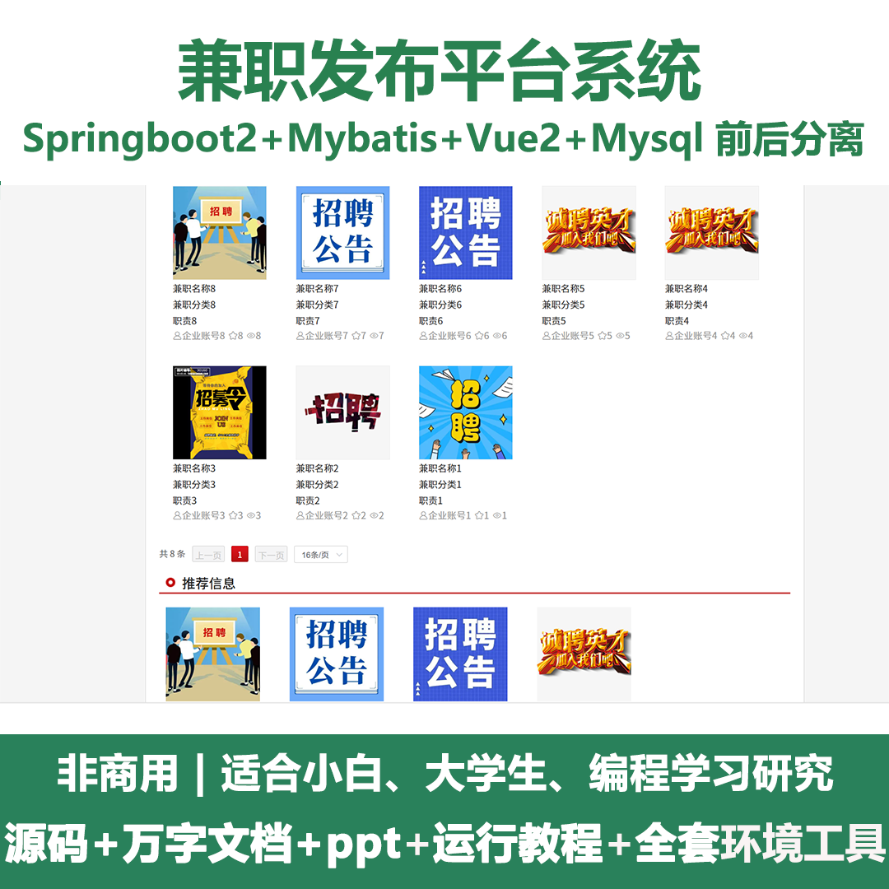
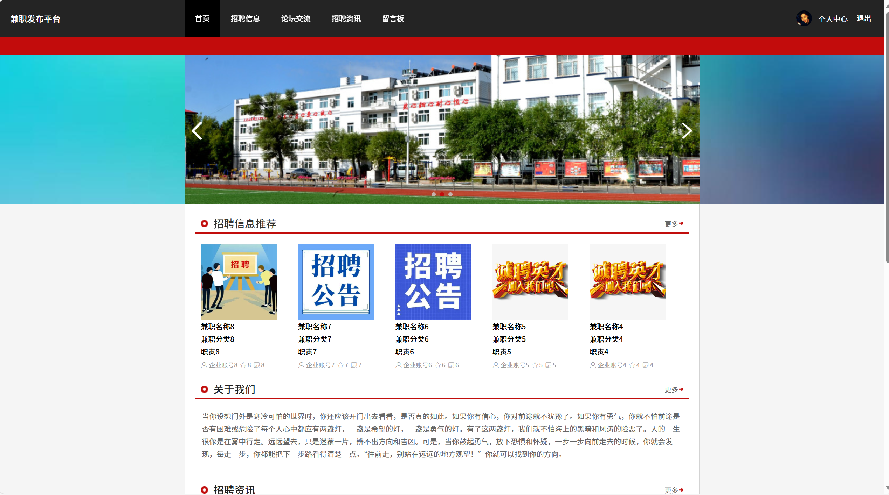
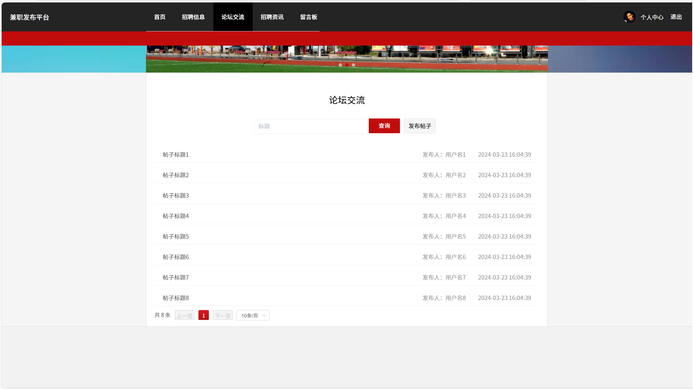
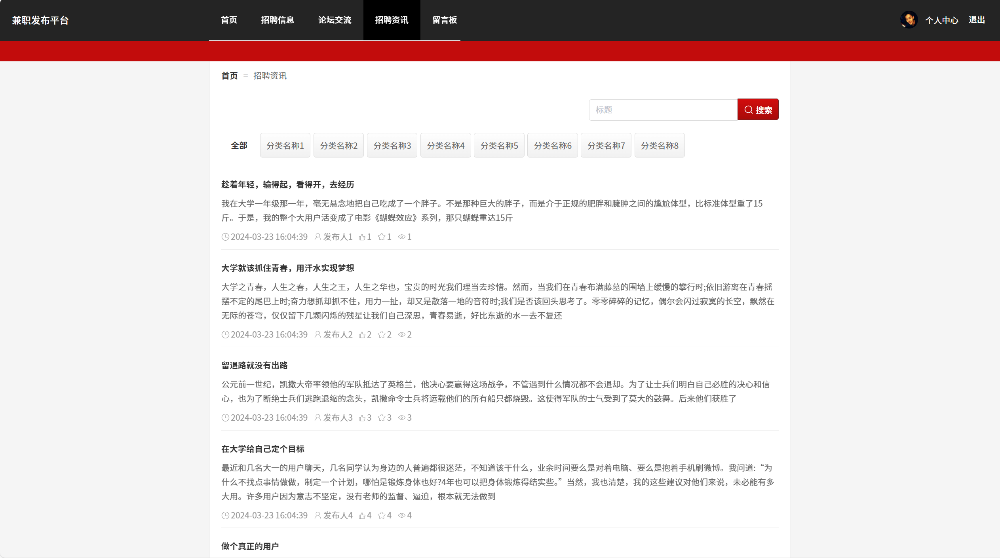
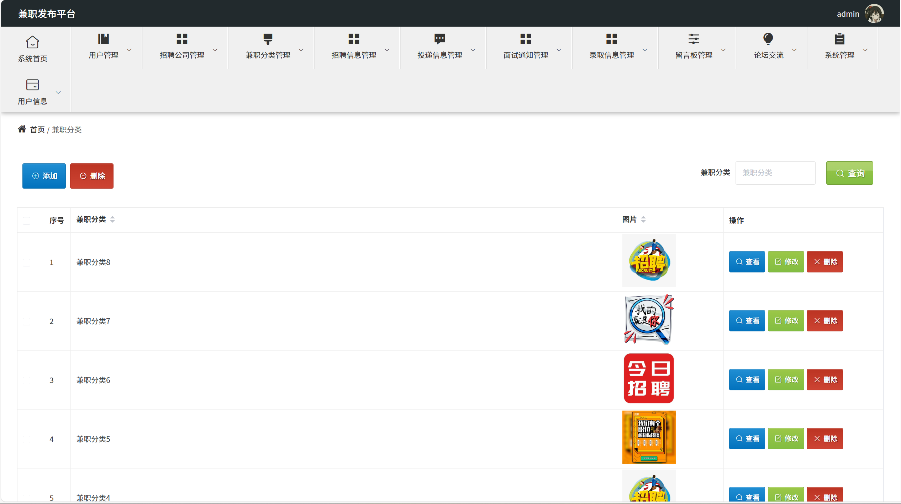
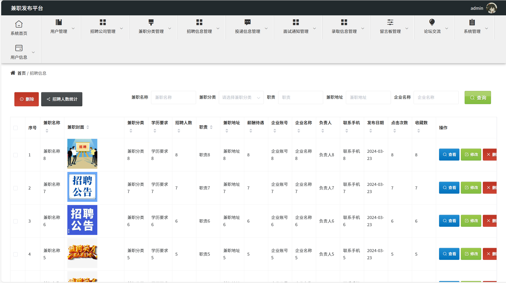
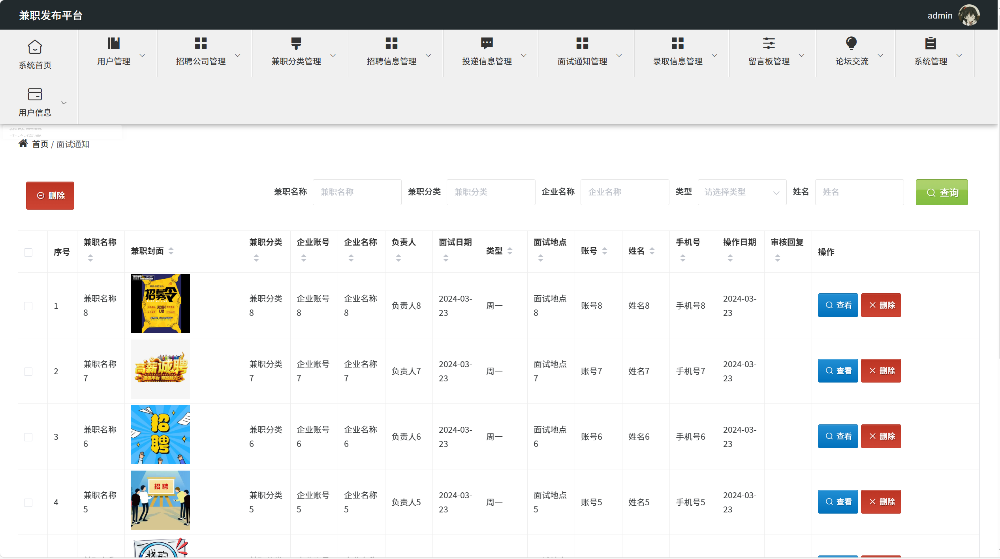
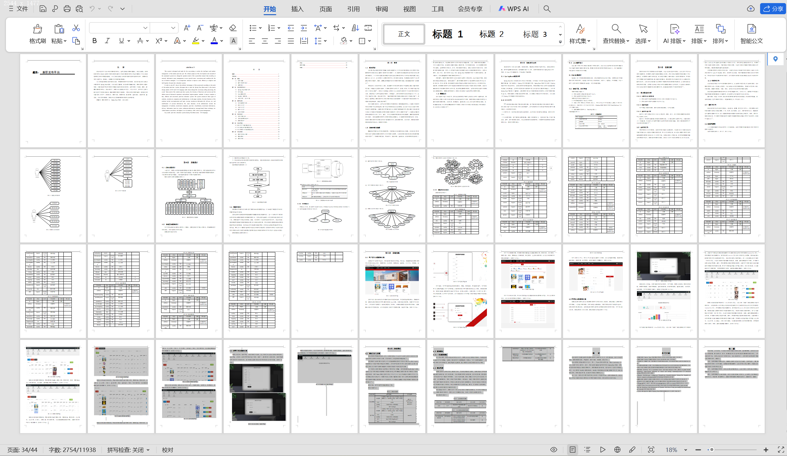

# springbootA421
springbootA421兼职发布平台+LW+PPT
 
## 查看主页获取源码

### 一、关键词

兼职岗位发布平台，兼职发布管理系统，短期工发布平台
 

### 二、作品包含

源码+数据库+设计文档万字+全套环境和工具资源+部署教程

 

### 三、项目技术

前端技术：Html、Css、Js、Vue2.0、Element-ui 
后端技术：Java、SpringBoot2.0、MyBatis

  

 

### 四、运行环境（以下版本亲测，其他版本未知，请自测）

开发工具：IDEA/eclipse  + VSCODE

数据库：MySQL5.7（最低要5.7版本）

数据库管理工具：Navicat10以上版本

环境配置软件： JDK1.8 + Maven3.6.3

前端Nodejs：14

浏览器：谷歌浏览器

 

### 五、项目介绍

项目编号：springbootA421

 兼职发布平台自动化系统的开发和研制的最终目的是将兼职发布平台的运作模式从手工记录数据转变为网络信息查询管理，从而为现代管理人员的使用提供更多的便利和条件。使兼职发布平台数字化、智能化，是提高工作效率的重要举措。
 系统用户、招聘公司与管理员三类人，作为目用户，其中用户主要功能包含用户的注册与登录，查看招聘信息进行投递等，对账号相关信息的修改；管理员主要功能包括了对用户、招聘公司、兼职分类、招聘信息、投递信息、面试通知、录取信息、留言板、论坛交流等管理；管理员可以实现最高权限级别的全系统管理，
 
### 六、运行截图

